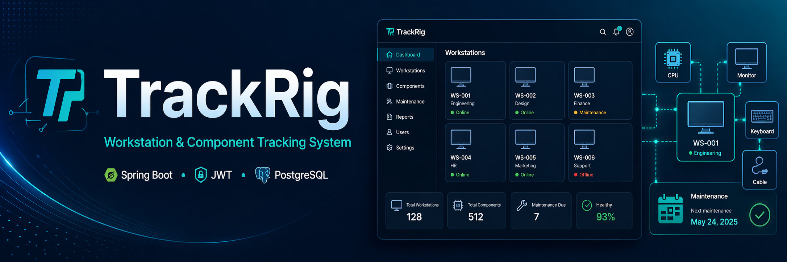

<p align="center">
  
</p>

TrackRig is a web-based workstation and hardware tracking system designed for environments with many managed computers, such as offices, factories, internet cafés, computer labs, and workshops. It helps IT teams organize workstations, track physical components, manage assignments, and monitor maintenance tasks from one central place.

The project was built to simplify equipment management by keeping workstation, component, assignment, and maintenance data in a single system. It was developed using Vue for the frontend, Spring Boot for the backend API and security layer, and PostgreSQL for data storage. The application was successfully deployed on my own VPS using Docker for containerization and Nginx for serving the frontend and reverse proxying the backend.

---

## Main Features

* User registration and login with JWT authentication
* Role-based access for `EMPLOYEE`, `MANAGER`, and `OWNER`
* Workstation management with status and grid/floor position tracking
* Component management with categories, statuses, and workstation assignment
* Component assignment history with active and previous assignments
* Maintenance types and logs
* Maintenance status tracking for due, overdue, and never-completed tasks

---

## Technologies Used

### Backend

* Java
* Spring Boot
* Spring Web
* Spring Security
* JWT authentication
* Spring Data JPA
* Hibernate
* PostgreSQL

### Database

* PostgreSQL relational database
* Tables for users, workstations, components, assignment logs, and maintenance
* Database constraints for safer data handling
* SQL view for maintenance status calculation

---

## Spring Implementation

The backend is implemented as a Spring Boot REST API.

### Spring Web

Spring Web is used to expose REST endpoints through controller classes. Each main module has its own group of endpoints, such as authentication, users, workstations, components, assignments, and maintenance.

### Spring Security and JWT

Spring Security protects the API. Users log in through the authentication endpoint and receive a JWT token. Protected endpoints require the token in the `Authorization` header:

```http
Authorization: Bearer <token>
```

User roles are used to control access to specific actions. For example, only an `OWNER` can manage all users.

### Spring Data JPA and Hibernate

Spring Data JPA is used to communicate with the PostgreSQL database. Entities represent database tables, repositories handle database queries, and services contain the main business logic.

Hibernate is used as the JPA provider to map Java objects to database records.

### Layered Structure

The project follows a common Spring Boot structure:

```text
Controller -> Service -> Repository -> Database
```

* Controllers receive HTTP requests
* Services handle business logic
* Repositories communicate with the database
* Entities represent database tables

---

## User Roles

| Role       | Description                                                                      |
| ---------- | -------------------------------------------------------------------------------- |
| `EMPLOYEE` | Basic user who can use the system for normal tracking and maintenance tasks.     |
| `MANAGER`  | User who can manage workstations, components, assignments, and maintenance data. |
| `OWNER`    | Highest-level user with full control, including user management.                 |

---

## API Base URL

```text
http://localhost:8080
```

All endpoints except `/auth/*` require authentication using a Bearer Token.

---

## API Endpoints

### Authentication

| Method | Endpoint         | Description                   |
| ------ | ---------------- | ----------------------------- |
| POST   | `/auth/register` | Register a new user account   |
| POST   | `/auth/login`    | Login and receive a JWT token |

---

### Users

| Method | Endpoint             | Description                  | Access        |
| ------ | -------------------- | ---------------------------- | ------------- |
| GET    | `/users/me`          | Get current user profile     | Authenticated |
| PATCH  | `/users/me`          | Update current user profile  | Authenticated |
| PATCH  | `/users/me/password` | Change current user password | Authenticated |
| DELETE | `/users/me`          | Delete current user account  | Authenticated |
| GET    | `/users`             | List all users               | OWNER         |
| GET    | `/users/{id}`        | Get user by ID               | OWNER         |
| PATCH  | `/users/{id}`        | Update user by ID            | OWNER         |
| DELETE | `/users/{id}`        | Delete user by ID            | OWNER         |

---

### Workstations

| Method | Endpoint                    | Description                |
| ------ | --------------------------- | -------------------------- |
| GET    | `/workstations`             | List all workstations      |
| GET    | `/workstations/{id}`        | Get workstation by ID      |
| POST   | `/workstations`             | Create a workstation       |
| PATCH  | `/workstations/{id}`        | Update workstation details |
| DELETE | `/workstations/{id}`        | Delete a workstation       |
| PATCH  | `/workstations/{id}/status` | Update workstation status  |

#### Workstation Statuses

| Method | Endpoint                    | Description      |
| ------ | --------------------------- | ---------------- |
| GET    | `/workstations/status`      | List statuses    |
| GET    | `/workstations/status/{id}` | Get status by ID |
| POST   | `/workstations/status`      | Create status    |
| PATCH  | `/workstations/status/{id}` | Update status    |
| DELETE | `/workstations/status/{id}` | Delete status    |

---

### Components

| Method | Endpoint                       | Description                    |
| ------ | ------------------------------ | ------------------------------ |
| GET    | `/components`                  | List all components            |
| GET    | `/components/{id}`             | Get component by ID            |
| POST   | `/components`                  | Create component               |
| PATCH  | `/components/{id}`             | Update component details       |
| DELETE | `/components/{id}`             | Delete component               |
| PATCH  | `/components/{id}/workstation` | Assign or unassign workstation |
| PATCH  | `/components/{id}/category`    | Assign category                |
| PATCH  | `/components/{id}/status`      | Assign status                  |

#### Component Categories

| Method | Endpoint                      | Description        |
| ------ | ----------------------------- | ------------------ |
| GET    | `/components/categories`      | List categories    |
| GET    | `/components/categories/{id}` | Get category by ID |
| POST   | `/components/categories`      | Create category    |
| PATCH  | `/components/categories/{id}` | Update category    |
| DELETE | `/components/categories/{id}` | Delete category    |

#### Component Statuses

| Method | Endpoint                  | Description      |
| ------ | ------------------------- | ---------------- |
| GET    | `/components/status`      | List statuses    |
| GET    | `/components/status/{id}` | Get status by ID |
| POST   | `/components/status`      | Create status    |
| PATCH  | `/components/status/{id}` | Update status    |
| DELETE | `/components/status/{id}` | Delete status    |

---

### Component Assignment History

| Method | Endpoint                                       | Description               |
| ------ | ---------------------------------------------- | ------------------------- |
| GET    | `/component-assignments`                       | List assignment logs      |
| GET    | `/component-assignments/component/{id}`        | Logs by component         |
| GET    | `/component-assignments/workstation/{id}`      | Logs by workstation       |
| GET    | `/component-assignments/component/{id}/active` | Current active assignment |
| POST   | `/component-assignments`                       | Create assignment         |
| PATCH  | `/component-assignments/component/{id}/close`  | Close active assignment   |

When a component is assigned to a new workstation, the previous active assignment is closed automatically.

---

### Maintenance

#### Maintenance Types

| Method | Endpoint                    | Description                   |
| ------ | --------------------------- | ----------------------------- |
| GET    | `/maintenance/types`        | List all maintenance types    |
| GET    | `/maintenance/types/active` | List active maintenance types |
| POST   | `/maintenance/types`        | Create maintenance type       |
| PATCH  | `/maintenance/types/{id}`   | Update maintenance type       |
| DELETE | `/maintenance/types/{id}`   | Delete maintenance type       |

#### Maintenance Logs

| Method | Endpoint                             | Description               |
| ------ | ------------------------------------ | ------------------------- |
| GET    | `/maintenance/logs`                  | List all maintenance logs |
| POST   | `/maintenance/logs`                  | Create maintenance log    |
| GET    | `/maintenance/logs/{id}`             | Get log by ID             |
| DELETE | `/maintenance/logs/{id}`             | Delete log                |
| GET    | `/maintenance/logs/workstation/{id}` | Logs by workstation       |
| GET    | `/maintenance/logs/type/{id}`        | Logs by type              |

#### Maintenance Status

| Method | Endpoint                               | Description                   |
| ------ | -------------------------------------- | ----------------------------- |
| GET    | `/maintenance/status`                  | List all maintenance statuses |
| GET    | `/maintenance/status/workstation/{id}` | Status by workstation         |
| GET    | `/maintenance/status/overdue`          | List overdue maintenance      |

Maintenance status can show whether a task is:

* `NEVER_DONE`
* `OVERDUE`
* `DUE_SOON`
* `OK`

---

## Example Request Payloads

### Create Component

```json
{
  "serialNumber": "SN-SPRING-001",
  "name": "Intel Core i7",
  "notes": "Test component",
  "componentCategory": { "id": 1 },
  "componentStatus": { "id": 1 },
  "workstation": { "name": "Workstation A" }
}
```

### Create Component Assignment

```json
{
  "componentId": 1,
  "workstationId": 5,
  "notes": "Moving to development rig"
}
```

### Create Maintenance Type

```json
{
  "name": "Monthly Cleaning",
  "description": "Clean filters and fans",
  "intervalDays": 30,
  "isActive": true
}
```

### Update Workstation Position

```json
{
  "gridX": 5,
  "gridY": 10,
  "floor": 2
}
```

---

## Database Overview

TrackRig uses PostgreSQL to store the main application data.

Main database areas:

* Users and roles
* Workstations and workstation statuses
* Components, categories, and statuses
* Component assignment history
* Maintenance types and maintenance logs

The database also includes rules that help protect data, such as preventing duplicate workstation positions and keeping only one active assignment per component.

---

## Project Purpose

TrackRig was created to improve organization and tracking of physical equipment. Instead of managing components and maintenance manually, users can track everything through a central web-based system with clear roles, structured data, and maintenance monitoring.
